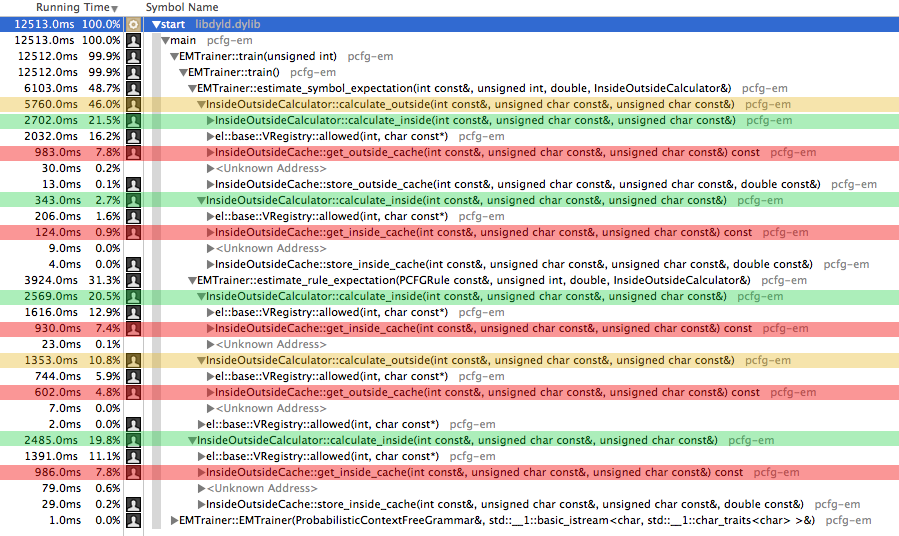

# EM-Algorithm for PCFGs 

1. [Abstract]()
2. [Usage]()
    1. [Command Line Options]()
    2. [Verbose levels]()
3. Class descriptions
    1. ProbabilisticContextFreeGrammar
    2. Signature
    3. PCFGRule
    4. InsideOutsideCalculator
    5. InsideOutsideCache
    6. EMTrainer
4. Optimisation
5. Benchmarks
6. Current issues
7. Acknowledgements

## Abstract
This program provides a basic implementation of the inside-outside algorithm, an expectation-maximization algorithm for probabilistic context free grammars. It learns the probability distribution for the production rules in an unsupervised way from a text corpus.

## Usage
### Command line options
```
  --help                  Print help messages
  -g [ --grammar ] arg    Path to a PCFG.
  -c [ --corpus ] arg     Path to the training set with sentences separated by 
                          newlines.
  -s [ --save ] arg       Path to save the altered grammar
  -o [ --out ]            Output the grammar after the training.
  -i [ --iterations ] arg Amount of training circles to perform. (Default: 3)
  -t [ --threshold ] arg  The changes after the final iteration must be less 
                          equal to this value. Do not combine with  -i.
  -v [ --vlevel ] arg     Define the verbose level (0-10). E.g.: --v=2
```
**Required: --grammar, -g**

The path to the grammar file, that should be optimised.
The first line of the file contains only the start symbol of the grammar, while all other lines contain one rule: A left-hand side symbol, an arrow '*->*' and a right-hand side followed by a probability in brackets. Note that the probability is of course optional. If a probability value is given, it is used as the starting value for the training algorithm. The symbols on the right-hand side are separated by blanks. It is not needed to escape special characters as all symbols between two blanks are seen as one symbol.

*Example for a grammar file:*
```
S
S -> NP VP [1.0]
NP -> Maria [1.0]
VP -> schläft [1.0]
```
**Required: --corpus, -c**

The path to the corpus file. It must store one sentence per line and the sentences must be tokenized in a previous step so that all terminal symbols are separated by blanks.
Please make sure, that the provided grammar contains rules for all the terminal symbols in the corpus.

**--save, -s**

Path to a file to write the newly created PCFG to. Note that rules of the original PCFG that have the probability of zero will not be written into the new file.

**--out, -o**

Print the newly created PCFG to the console after the training has been performed.

**--iterations**

*Note: Not to be combined with --threshold*

Specify the number of iterations of the algorithm. The default value is 3.

**--threshold**

*Note: Not to be combined with --iterations*

After each iteration the root mean square error of the new probability distribution and the one from the previous step is calculated. If you provide a threshold, the training will stop as soon as the RMSQ is equal or less to the given threshold. Depending on your data, this can take a while.

**--v=**

Specify the verbose level for detailed information about the program. See [Verbose Levels] for more details.

### Verbose Levels
To learn more about the inner processes of this program, you can activate the verbose mode. To do so, choose the option *--v=* followed by an integer between 1 and 10 while 1 output only a few messages and 10 makes the program print all of them.

**Note:**
Depending on the input sentence and the size of the grammar, choosing a high verbose level can result in millions of messages. To gain useful information about the most inner processes, choose a very small grammar and a short sentence.

| Level | Messages |
|-------|----------|
| 1     | EMTrainer: Detailed results of the training.
| 2     | EMTrainer: Results per iteration
| 3     | EMTrainer: Current sentence and inside probability of the current sentence
| 4     | EMTrainer: Training corpus read in
|       | PCFG: General cleaning process
| 5     | PCFG: Detailed cleaning process, start symbol
| 6     | EMTrainer: Result of symbol and rule estimation, line-by-line corpus read in
| 7     | InsideOutsideCalculator: General information about the calculations
| 8     | InsideOutsideCalculator: Detailed information about the calculations
| 9     | PCFGRule: Rule created successfully
|       | Signature: Index of new item in the signature
|       | EMTrainer: Per rule probability update
| 10    | InsideOutsideCache: Result of the bit concatenation of the map keys


## Class Description
### ProbabilisticContextFreeGrammar
This class manages the PCFG that is represented by a set of rules and a start symbol. To initialise the class, you have to handle the constructor an *istream* object to a grammar (e.g. a read in file). It then reads the stream line by line and creates PCFGRule objects. The first line is reserved for the starting symbol.

The rules within this grammar can be accessed either by a given left-hand side symbol or by a symbol, that is the first / second nonterminal on the right-hand side of a rule (this is very useful for the inside-outside algorithm).

Internally, the rules are stored in a sorted vector. Asserting that the grammar cannot be changed after the creation process, we then can define intervals for each left-hand side symbol that are values in a map with LHS symbols as values. 
To avoid duplicating the rules for the inside-outside access approach, we crate a vector of constant pointers to rules for each case (symbol is the first / second symbol on the right-hand side of a rule).

Another useful feature of this grammar is the ability to remove all rules with a probability of zero. To do this, it sorts the rules in the index by their probability score and deletes all rules with a zero probability in one step. After this, a reconstruction of the data structures needed for the access functions is required. Even though this sound very inefficient at first, it actually increases the speed of further training iterations (see 'Optimisation' for more details).

### Signature
To speed up the comparison of symbols, a signature is used to translate their string representations to integers and vice versa.

The implementation is quite simple: A hash map maps strings (or other objects since the class is implemented as template) to their numeric equivalent and a vector of strings is organised in a way that the index of each item is its numeric representation.

### PCFGRule
A PCFGRule can only be created from a string that is automatically parsed. To do so, the constructor needs a reference to a signature as well, so it can translate the string of the symbols to numeric values. If the parsing fails, the whole object becomes invalid.

Though left-hand side and right-hand side cannot be changed, a PCFGRule object has a method to alter its probability value. 

Notable is the subclass 'Hasher' that is needed to compute the hashcode for integer representations of the symbols and the struct 'ProabilityComparator' that allows to sort PCFGRule objects only by their probability score (needed for the cleaning step in the ProbabilisticContextFreeGrammar).

### InsideOutsideCalculator
Here, the algorithm to calculate inside and outside probabilities is implemented (based on 'Foundations of Statistical Natural Language Processing' by  Manning and Schütze). For each new sentence, a new instance of this calculator should be created, because it uses a cache to prevent the multiple calculation of the same data. The calculated estimates depend on the terminal symbols (base case of the inside algorithm), so it is not possible to use same cache for multiple sentences. 

To calculate the inside estimate of a symbol for a span, call *'calculate_inside'* with a reference to the symbol, the index of the beginning of the span and to the end of the span. The outside probability is calculated by *'calculate_putside'*. This method as well takes a reference to a symbol and a number of words to the left and to the right. Further details about the algorithms themselves can be found in the comments of the code.

### InsideOutsideCache
Each InsideOutsideCalculator object contains a cache to save the calculated values for the (Symbol, Integer, Integer) triples. This cache simply maps the triples to their score in two separate hash maps, one for inside and one for outside values. 

Instead of using a pair of pairs to represent the triple, the cache concatenates the bits of the three variables to a 64 bit variable that is used as key in the maps. This approach makes the assumption, that sum of the bits of the variable does not exceed 64 bit. By choosing a 32 bit integer value for the symbol (more than enough space to store millions of symbols) and 8 bit integers for the two other variables, this criteria is matched. The two 8 bit variables store only information about the sentence itself and since sentences longer than 255 tokens should neither exist in a treebank, nor is et virtually possible to parse a sentence of this length in adequate time, it should not be a problem. 

Here is an example for the bit concatenation:

> Let us assume we have the variables s, x and y where s is a 32 bit variable and x and y can store 8 bits.
> 
> We set s = 123456, x = 3, y = 12.
> Now the bit pattern for the variables are now as following:
> ```
> s : 1110001001000000
> x : 0011
> y : 1100
```
> We copy the bits of s in the 64 bit buffer b:
> ```
> b : 0000000000000000000000000000000000000000000000001110001001000000
> ```
> Now we concatenate it with x:
> ```
> b : 0000000000000000000000000000000000000000000011100010010000000011
> ```
> And y:
> ```
> b : 0000000000000000000000000000000000000000111000100100000000111100
>```

This way, the three variables have been combined to one unique key without hashing (although it will be cashed again by the map). In the 'Optimisation' section, the performance of this procedure is described.

### EMTrainer
This class performs the actual training of the PCFG. It is initialised with a reference to an *istream* to a training corpus, wich is read in line by line, tokenised and translated to symbols of the signature of the PCFG. If a sentence contains an unknown symbol, the sentence will be ignored because it cannot get estimates higher than zero.

The trainer can be run in two different modes: Either with a given number of iterations or a threshold. In the first mode, the training algorithm is simply called as often as specified. The other mode performs the training, until the root mean square error between the rules after the last iteration and the rules in the previous iteration are equal to or below the threshold. 

The RMSQ value is the output if the private *train()* method wich performs the training by calculating the inside probability of each sentence in the corpus and estimating the symbol expectation for all nonterminals for each sentence. This is a rather straight forward implementation of the algorithm that can be found in 'Foundations of Statistical Natural Language Processing' by Manning and Schütze.

## Optimisation
After using a profiler to ensure that the program contains neither memory leaks nor extremely slow functions, the biggest performance bottleneck seems to be the read access of the cache.

### Caching
This cache itself extremely boosts the speed of the calculation. As an example, performing a training with only one iteration for a very small sentence (four tokens) and a grammar extracted from section 00 of the Wall Street Journal (7466 rules), there were overall 677579 calls for calculating inside or outside estimates. With the help of a cache, 92% of these calculations have been prevented by a lookup in the cache (622079 read accesses). Of course, this ratio increases with the number of iterations.

To improve the overall performance, there are two possibilities: one is to increase the speed of the cache itself, the other is to prevent redundant calculations in the first place.

### Removing rules with zero probability
Following the second approach first, all redundant rules will be removed from the grammar after the first iteration. The idea is, that if a probability of zero is assigned to a rule after the first training, it means that it has never been used in the given corpus. Since the inside-outside algorithm aims to improve the probability of all rules based on the sentences of a corpus, this zero probability rules will not play a role in further iterations, so they can be removed.

The smaller the corpus, the higher is the percentage of redundant rules. In case of the small four-token sentence mentioned before, there have been 677579 calculations in the first iteration but only 4646 after removing the rules (0.001%).

In cases with more and longer sentences, the speed of the program increased up to 50%.

### Optimising the cache
Even though minimising the number of accesses to the cache improves the performance, it is crucial to optimise the cache itself. 

The cache uses a triple of a symbol and two integers as keys. Creating two pair objects for each lookup in the cache can be very time consuming. To get rid of this, the bits of the variables will be concatenated into one 64 bit variable, that then will be used as the key in the hash map (see *InsideOutsideCache* for more details). Of course it is still necessary to compute the hash value of the key, but by avoiding the creation if the pair objects, the execution of the program becomes about 20% faster.

*Note:* 
Using a 32 bit variable instead of 64 bit one had no measurable effect. 

### Different hash map implementations
This program only uses the unordered map from the C++ Standard library. Using other implementations like boost decreased the speed by about 30%.

## Benchmarks

### Profiler
This is a screenshot of a time profiler of the final version of the program:



Note that the methods *calculate_outside* and *calculate_inside* are highly recursive. It can be seen, that the program spends most of its time (99,9%) in the estimation of symbols and rules. These methods then again consume most time by accessing the cache (marked red) or in writing verbose messages (el::base). 

The used class for verbose logging is unfortunately consuming a lot of time. Logging can be disabled by defining the macro *\_ELPP\_DISABLE\_LOGS*, but even then its amount of time is about 13%. This is a tradeoff that had to be made to make the processes of this implementation more understandable since it is mostly written for understanding the algorithm and programming practice.

### Testrun


## Current issues
As mentioned before, the bad performance of the program makes it virtually unusable for huge grammars and long sentences. 

The performance of the maps in the cache have to be drastically improved or - if possible - to be replaced by a more efficient data structure.

Also, the usage of a logging class slows the program down by up to 15%. If one really aims toward great performance and does not care about implementation details at runtime, this class should be removed.

Currently the root mean square error in the *EMTrainer* class compares only the new probability of the rules with the ones from the previous iteration. In fact it would be better to save the values of the original grammar and compare it to the new probabilities after each iteration.


## Acknowledgements
* The implemented algorithm is taken from: *Manning, Christopher D. Foundations of statistical natural language processing. Ed. Hinrich Schütze. MIT press, 1999.*
* Used class for logging: [Easylogging++](https://github.com/easylogging/easyloggingpp)
* Boost library
* Foundation of the PCFG and PCFGRule class: [tagh.de/tom](http://tagh.de/tom/) 

	
